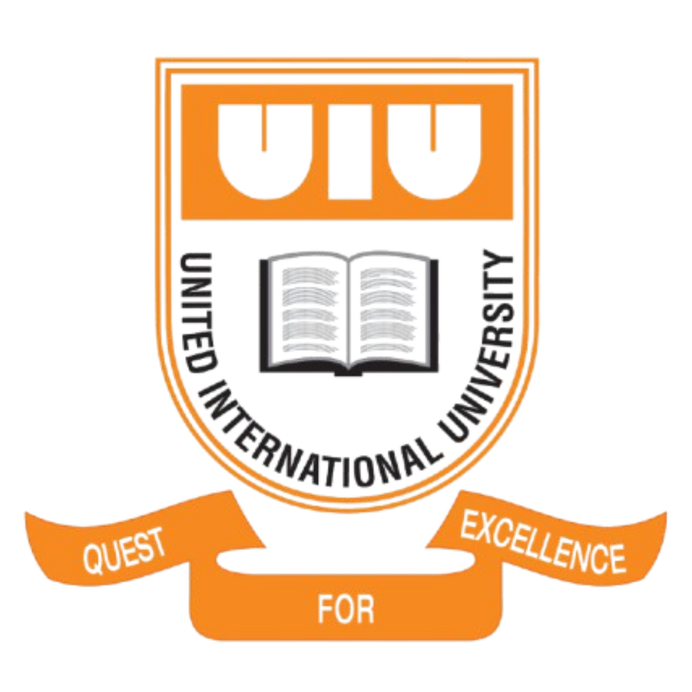

# UIU Contest Archive 🏆



A comprehensive archive of United International University's participation and achievements in various programming contests.

## 🌟 Features

- **Contest History**: Browse through UIU's participation in ICPC, NCPC, IUPC and other programming contests
- **Team Tracking**: View team compositions, rankings, and achievements
- **Smart Search**: Search contests by name, year, team members, or contest type
- **Sorting Options**: Sort contests by date or name
- **Dark/Light Mode**: Toggle between dark and light themes for comfortable viewing
- **Responsive Design**: Works seamlessly on desktop and mobile devices

## 🚀 Quick Start

1. Visit the live site: [UIU Contest Archive](https://your-site-url.com)
2. Use the search bar to find specific contests or teams
3. Sort contests using the dropdown menu
4. Click on contest cards to view detailed team information
5. Toggle dark/light mode using the theme button

## 💻 Running Locally

1. Clone the repository:
```bash
git clone https://github.com/yourusername/UIU-Contest-Archive.git
```

2. Navigate to project directory:
```bash
cd UIU-Contest-Archive
```

3. Open with VS Code and use Live Server:
   - Install Live Server extension in VS Code
   - Right-click on `index.html`
   - Select "Open with Live Server"

## 🛠️ Tech Stack

- HTML5
- CSS3 (with CSS Variables for theming)
- Vanilla JavaScript
- Font Awesome Icons
- Google Fonts (Inter)

## 📱 Features Breakdown

### Contest Information
- Contest Name
- Year and Date
- Contest Type (ICPC, IUPC, etc.)
- Total Participating Teams
- Links to Contest Problems and Rankings

### Team Details
- Team Name
- Team Members
- Coach Information
- Final Position/Rank
- Team Photos (when available)
- Additional Remarks

## 🤝 Contributing

Want to contribute? Great!

1. Fork the repository
2. Create a new branch
3. Make your changes
4. Submit a pull request

Or contact us at: nnahin2420504@bscse.uiu.ac.bd

## 👥 Contributors

- Al-Muktadir Islam Mahit
  - [Facebook](https://www.facebook.com/al.muktadir.mahit)
  - [LinkedIn](https://www.linkedin.com/in/al-muktadir-islam-mahit-65b090294/)

- Najib Hossain Nahin
  - [Facebook](https://www.facebook.com/nahins10/)
  - [GitHub](https://github.com/nahinio)
  - [LinkedIn](https://www.linkedin.com/in/najib-hossain-nahin/)

## 📄 License

This project is licensed under the MIT License - see the [LICENSE.md](LICENSE.md) file for details.

## 🙏 Acknowledgments

- UIU CSE Department
- UIU Competitive Programming Community
- All UIU Programming Teams
- Contest Organizers

---
Made with 💙 for UIU's Competitive Programming Community